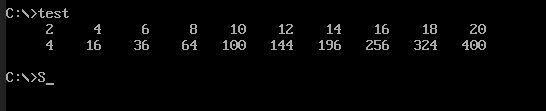

# Массивы

Заключающая работа, работа с массивами.

Нужно заполнить массив 20 чисел, половина из которых являются четными числами, другая их квадратами.

[Код программы](main.asm)



## Какой командой можно выделить в памяти место под одномерный массив байтов array размерностью 25?

```
array db 25 DUP (?)
```

## Опишите команды умножения на байт и на слово.


```
Для 1 байта
AX*BL = AL, AH
```

```
Для 2 байтов
AX*BX = AX, DX
```

```
4-байта
EAX*EBX = EAX, EDX
```


## Какое максимальное беззнаковое число можно хранить в элементе массива размером в 1 байт?

Беззнаковые целые числа представляются в виде последовательности битов в диапазоне от _0_ до _2n-1_, где **n** - количество занимаемых битов.

То есть можно хранить числа от 0 до 255.

## Пусть имеется массив: array DW 50 DUP(?). Для доступа к отдельным элементам массива используется адресное выражение array[SI]. Как называется этот способ адресации и как с его помощью будет вычисляться адрес элементов массива?

Называется индексной адресацией со смещением. Предполагается, что базовый адрес сегмента, в который входит массив mas, загружен в DS. Таким образом, имя массива __array__ ассемблер считает относительным адресом начала массива в сегменте данных.

Инструкцию ```mov DL,MAS[BX]``` можно переписать как ```mov DL,[MAS+BX]```, где адрес в квадратных скобках равен сумме адреса, связанного с именем массива и относительного адреса (относительно начала массива), хранящегося в регистре BX .