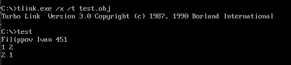

# Вывод цифры
---

Продолжаем изучать прекрасный язык ассемблер. На очереди вывод обычной цифры на экран.

Нужно вывести имя ФИО и номер группы, после занести в **AX** и **BX** по одной цифре, вывести их на экран, поменять значения регистров местами не используя дополнительную память.

Сделано двумя вариантами:

[Хитрый вариант](main.asm)



[Нормальный вариант](normal.asm)


## В какой регистр надо поместить код выводимого символа?

Регистр **DL**

## Какой код Dos-функции используется для вывода отдельного символа на экран?

Для вывода одного символа используется код **02h**

## Какая операция позволяет получить для цифры её код в кодовой таблице?

Добавление символа 0
```
add AL,30h
```

## Объясните назначение процедуры. Как определяются начало и конец процедуры?

Процедуры или же подпрограммы выступают как некоторый аналог функций в языках программирования высокого уровня. Нужны для создания модульного приложения.


Пример вызова
```
<имя_процедуры> PROC <параметр>
<тело_процедуры>
ret ;Возврат из подпрограммы в точку вызова
<имя_процедуры> ENDP
```

## Каким может быть взаимное расположение главной процедуры и подпрограмм?

В общем случае, размещать подпрограмму в теле программы можно где угодно, но при этом следует помнить, что сама по себе подпрограмма выполняться не должна, а должна выполняться лишь при обращении к ней. Поэтому подпрограммы принято размещать либо в конце сегмента кода, после команд завершения программы, либо в самом начале сегмента кода, перед точкой входа в программу. В больших программах подпрограммы нередко размещают в отдельном кодовом сегменте.

## Как процессор использует стек при работе с любой процедурой?

При вызове процедуры в стеке сохраняется адрес возврата в вызывающую программу:

* при вызове ближней процедуры – слово, содержащее смещение точки вызова относительно текущего кодового сегмента.
* при вызове дальней процедуры – слово, содержащее адрес сегмента, в котором расположена точка возврата, и слово, содержащее смещение точки возврата в этом сегменте.

При передаче управления процедуре микропроцессор автоматически записывает в вершину стека 4 байта. Эти байты являются адресом возврата в вызывающую программу. Если перед передачей управления процедуре командой call в стек были записаны переданные процедуре данные или указатели на них, то они окажутся под адресом возврата.

## С помощью какой команды вызывается процедура? Как меняется значение регистра SP после вызова процедуры?

С помощью команды ```call```
В регистр заносится адрес возврата, и когда вызывается ```ret```, он берет значение из стека и возвращается в адрес вызова после ```cal```

## После какой команды процедуры из стека извлекается адрес возврата?

```
test proc
    ret
rest endp
```