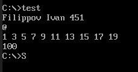

[Вернуться в начало](../../README.md)

# Контрольная работа

Три задания:

1. Напишите программу, которая выводит на экран символ __'@'__.
2. Создайте другую программу, где в сегменте данных объявите массив для хранения 10 чисел. В программе организуйте цикл для заполнения массива нечетными числами от 1 до 19. Вычислите в регистре AX и выведите на экран сумму элементов массива. Программа должна также в отдельной строке вывести на экран фамилию и имя студента.
3. Как организовано сегментирование памяти в процессорах Intel 8086?

## Ответы

Первое и второе задание объединил в одно.

[Код программы](main.asm)

## Сегментирование памяти

 процессоре Intel 8086 сегментирование памяти организовано следующим образом.

Вся память системы представляется не в виде непрерывного пространства, а в виде нескольких кусков — сегментов заданного размера (по 64 Кбайта), положение которых в пространстве памяти можно изменять программным путем.

Для хранения кодов адресов памяти используются не отдельные регистры, а пары регистров:

* сегментный регистр определяет адрес начала сегмента (то есть положение сегмента в памяти);

* регистр указателя (регистр смещения) определяет положение рабочего адреса внутри сегмента.

Сегмент может начинаться только на 16-байтной границе памяти (так как адрес начала сегмента, по сути, имеет четыре младших нулевых разряда), то есть с адреса, кратного 16. Эти допустимые границы сегментов называются границами параграфов. введение сегментирования, прежде всего, связано с тем, что внутренние регистры процессора 16-разрядные, а физический адрес памяти 20-разрядный (16-разрядный адрес позволяет использовать память только в 64 Кбайт, что явно недостаточно).