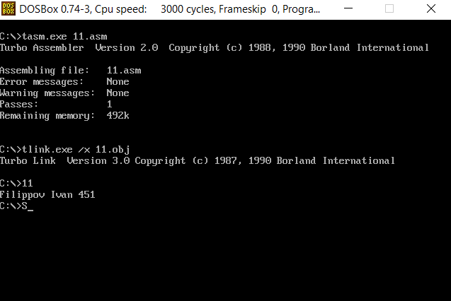
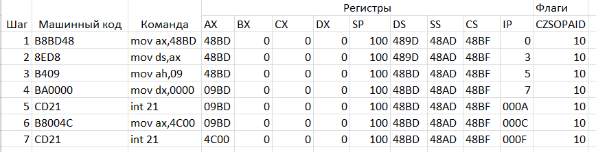
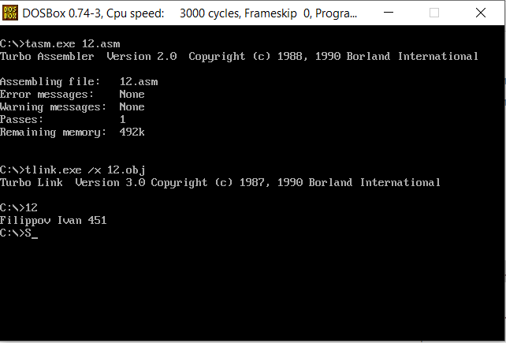
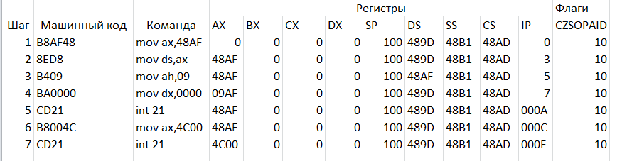
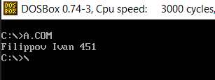
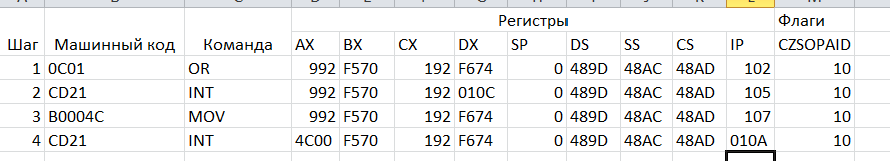

# Первое знакомство. Hello world!
---

## Пример 1

Структура EXE -программы, использующей «классический» способ задания сегментов с помощью директивы SEGMENT

[Код программы](classic.asm)





## Пример 2

Структура EXE -программы, использующей модель памяти SMALL и упрощенные директивы определения сегментов

[Код программы](small.asm)



## Пример 3

Структура COM -программы, использующей модель памяти TINY и упрощенные директивы определения сегментов

[Код программы](tiny.asm)



## Что такое сегментный (базовый) адрес?

Сегментные регистры имеют размеры в 16 разрядов, а содержащиеся в этих сегментах значения называются базовыми адресами сегментов.

Таких сегментов в основном три:
* Сегмент кода (CS)
* Сегмент данных (DS)
* Сегмент стека (SS)

В базовом адресе, который представляет собой 16 битное значение хранящиеся в регистрах сегмента, добавляется 4 нулевых бита, делая его 20 битным(полным адресом сегмента) и прибавляет смещение (исполнительный адрес). В таком случае у нас получается адрес на ячейку памяти в которой может хранится данные, инструкции и т.д.

## Размеры сегментов

На примере первой программы делаем трасировку и видим в каком порядке они расположились в памяти:

1. Базовый адрес сегмента DS: **489D**
2. Базовый адрес сегмента SS: **48AD**
3. Базовый адрес сегмента CS: **48BF**

## Почему DS меньше SS на 10h?

Сегмент стека в приведенной структуре описан с параметром STACK, поэтому в самой программе нет необходимости загружать сегментный регистр SS. В связи с этим в начале программы загружается лишь регистр DS. 

Адрес начала сегмента всегда кратен 16-ти (каждый сегмент должен начинаться на границе параграфа).

## Какие операторы называют директивами ассемблера?

Директивы в ассемблере являются указанием транслятору ассемблера на выполнение некоторых действий. Директивы указывают программе ассемблеру, каким образом следует объединять инструкции для создания модуля, который и станет работающей программой. У директив нет аналогов в машинном представлении.

Пример: 
```
MET: MOVE AX, BX ;Пересылка
ARRAY DB 0, 0, 0, 0, 0
COMMENT: длинный комментарий
```

## Сравните содержимое регистра SP в таблицах трассировки для программах 2 и 3.

Во 2-м примере SP = **0100h**, так как используется модель памяти small и стек располагается в первых 256 байтах сегмента памяти, а в 3-м – **FFFEh**, так как используется модель памяти tiny и сегменты кода, данных и стека находятся в одном сегменте размером 64 Кб.

## Зачем в последнем предложении end указывают метку, помечающую первую команду программы?

Для того, чтобы программа ассемблер поняла какая из подпрограмм закончена.

## Как числа размером в слово хранятся в памяти и как они заносятся в 2-ух байтовые регистры?

Они хранятся в памяти как шестнадцатеричное число и записываются справа налево. При занесении их в 2-х байтовые регистры байты меняются местами.

## Как инициализируются в программе выводимые на экран текстовые строки?

Сначала строка заносится в память также как и обычное число, а затем строка выводится на экран.

## Что нужно сделать, чтобы обратиться к DOS для вывода строки на экран?

Использовать оператор int 21h.

## Как DOS определит, где строка закончилась?

В конец строки всегда добавляется символ ```$```.

## Программы, которые должны исполняться как .EXE и .COM, имеют существенные различия, какие?

COM программы занимают меньше места в памяти и быстрее загружаются. В COM программах префикс программного сегмента, код программы, инициализированные данные и стек располагаются в одном сегменте. При запуске такой программы в начале строится PSP, занимающий 256 байт, далее располагается содержимое программы. Указатель стека устанавливается на конец сегмента.

EXE программы содержат сегменты кода, данных и стека. EXE файл загружается, начиная с адреса PSP:0100h. В процессе загрузки считывается информация EXE-заголовка в начале файла, при помощи которого загрузчик настраивает ссылки на сегменты в загруженном модуле, так как программа загружается в произвольный сегмент. После настройки ссылок управление передается загрузочному модулю к адресу CS:IP, извлеченному из заголовка EXE.

