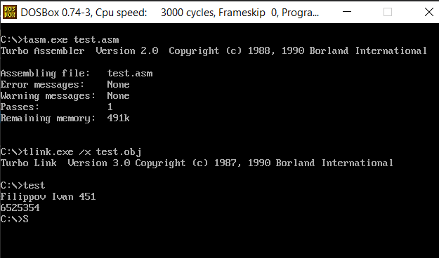

# Вывод числа

Теперь попробуем вывести число на экран. Задаем число в AX, и пытаемся его вывести.
Так как по стандарту регистр 16-разрядный, он больше 65000 вывести не может, по этому будем использовать 32-разрядные регистры общего назначения ```EAX```

[Код программы](main.asm)



## Чем отличается деление на байт от деления на слово?

```
Для 1 байта
AX/BL = AL, AH
```

```
Для 2 байтов
AX/BX = AX, DX
```

```
4-байта
EAX/EBX = EAX, EDX
```

## Как формируется машинный код для команд безусловного перехода типа SHORT, NEAR и FAR?

Безусловному переходу соответствует команда **JMP**. Эта команда может осуществлять переход вплоть до _32768_ байт. Если команда, на которую делается переход находится в том же сегменте памяти, что и команда __jmp__ – переход называется внутрисегментным или ближним (__near jmp__). Если при этом адрес перехода находится в пределах от -128 до +127 байтов от команды __jmp__ – такой переход называется коротким (__short jmp__). При использовании __short jmp__ и __near jmp__ изменяется только значение в регистре **IP**. Если команда находится в каком-либо другом сегменте программы – такой переход называется межсегментным или дальним (__far jmp__) – изменяется значение в регистре **IP**, а также значение **CS**.

## Каков механизм действия команды cmp?

Команда сравнения CMP сравнивает два числа, вычитая второе из первого. Инструкция CMP не сохраняет результат, а лишь устанавливает в соответствии с результатом флаги состояния. Основное назначение команды CMP – это организация ветвлений (условных переходов) в ассемблерных программах.

## С помощью команд условного и безусловного перехода выполните программную реализацию алгоритма ветвления для определения наименьшего числа из двух заданных.


```
cmp AX,BX
jl vr2
mov DX, BX
jmp cont
vr2: mov DX, AX
cont:
```

## Каков механизм работы команды организации цикла LOOP?

При каждой встрече с оператором loop, ассемблер сравнивает регистр CX с нулём, и если он ему не равен, то значение CX уменьшается на 1 и происходит переход к нужной метке.


## Как с помощью команды сдвига проверить содержимое регистра ВХ на четность?

Командой ```shr BH,1``` выполнить логический сдвиг вправо на 1 и затем узнать значение флага ```CF```. Если он ```= 1```, то число чётное, в противном случае – нечётное